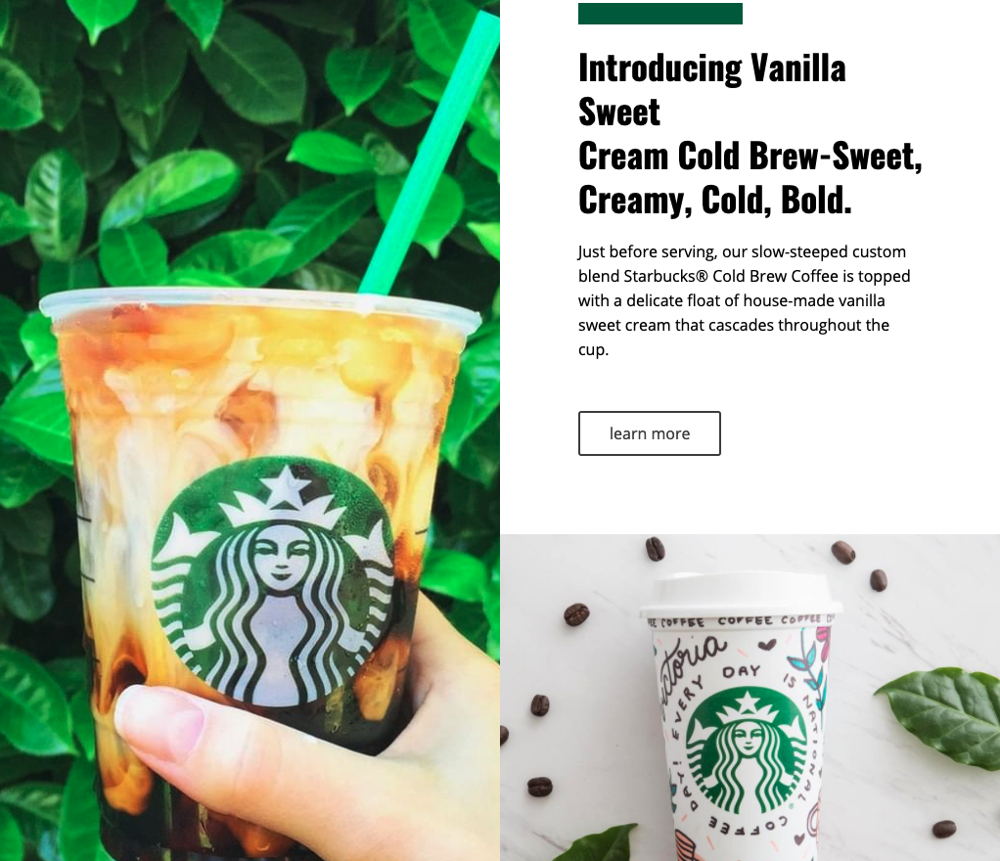

<h1 align="center">starbucks_page</h1>
<h3 align="center">
  Website layout using only Html and CSS, just for training.
   
  Layout credits for Nicepage.
</h3>

<h4 align="center"> 
	 Status: Finished
</h4>

## Layout

### Web

  
  
  
  
  
  

---

## Tech Stack

The following tools were used in the construction of the project:

- Html;
- CSS.